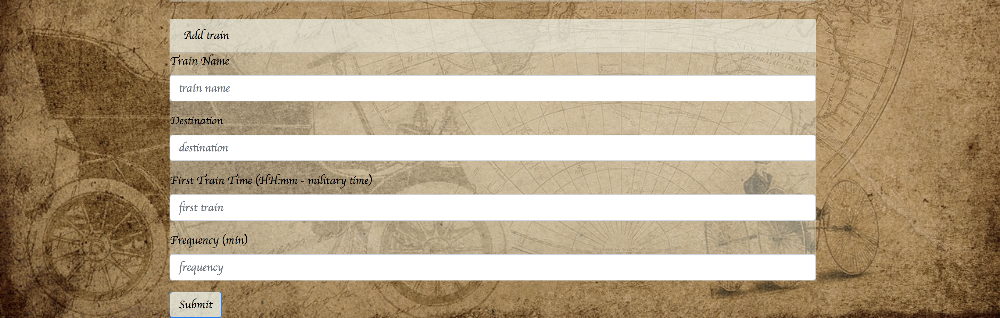

# TrainScheduler

*  Use the following link to get started [Train Scheduler](https://victoriagoesplaces.github.io/TrainScheduler/)

## About Train Scheduler

While using this app, you will have the availability to add train destinations. Additionally you will be able to calculate the arrival and the how many minutes you will have to wait for the next arrival. This is based on the time of the first train and the frequency of it. 

### Built With
* [Firebase](https://firebase.google.com/) - Used as the project database
* [Bootstrap](http://materializecss.com/) - css Framework (Admin Page)

### Screenshot

